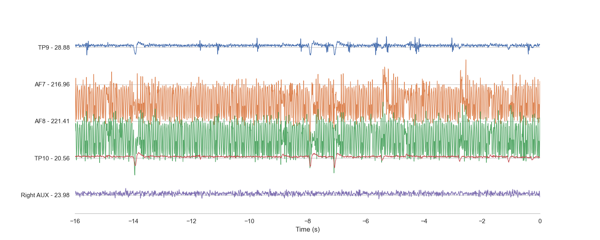

# MUSE-Ai
Hack RU - MUSE or AI

This repo is to be used as a project discussion forum for building our HACK RU profile 

currently we are using the following repos:

https://github.com/alexandrebarachant/muse-lsl/

https://github.com/kowalej/BlueMuse

We will have to use https://github.com/chkothe/pylsl to stream realtime data.

MUSE Manual PDF: 
https://bio-medical.com/media/support muse-brain-sensing-headband-user-guide.pdf

Connected our MUSE : Found device Muse-3E67, MAC Address 00:55:DA:B3:3E:67

Based on the () generated:
    The values on the left side of the plot represent the signal amplitudes for each EEG channel in microvolts (µV). EEG signals are typically in the range of a few microvolts to a hundred microvolts when measured from the scalp. In the plot you provided, each line corresponds to a different electrode placement on the scalp, and each electrode captures the electrical activity from different parts of the brain.

Here's what each label typically stands for:

TP9, TP10: These are locations for electrodes according to the international 10-20 system used for EEG electrode placement. TP9 and TP10 are located close to the ears (temporal regions). The value next to them (e.g., TP9 - 28.88) indicates the amplitude of the EEG signal at that electrode.

AF7, AF8: These are frontal sites, close to the prefrontal areas of the brain. The amplitudes here (e.g., AF7 - 216.96) are also indicative of the EEG signal strength at those locations.

Right AUX: This could be a reference to an auxiliary channel on the right side. The value (Right AUX - 23.98) again shows the amplitude of the signal at this auxiliary channel.